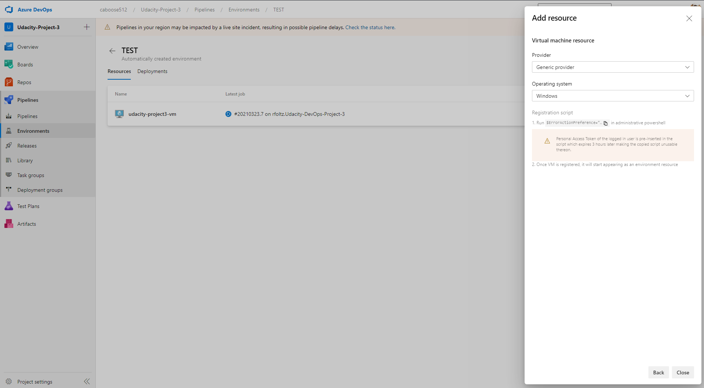
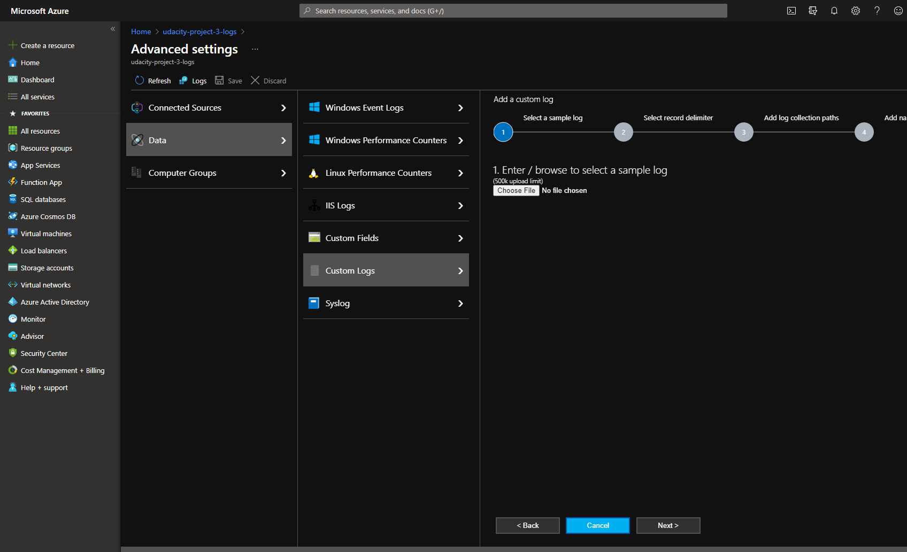
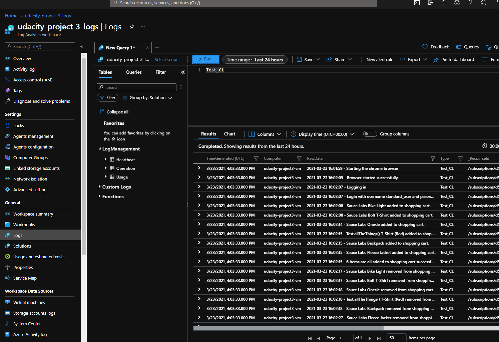

# Project 3 - Udacity Azure Dev Ops Nanodegree
[](https://dev.azure.com/caboose512/Udacity-Project-3/_build/latest?definitionId=5&branchName=master)

## Introduction
This is the 3rd project for the Azure Dev Ops nano degree. We will be using an Azure DevOps CI/CD pipeline to deploy and test our API. The main steps are to deploy a VM and App service via terraform than kick off a pipeline step of testing our API using postman, next step is to run a suite of JMeter performance tests and we'll create an alert in the for the App Service in Azure monitor, we will then run our functional UI test suite from Selemium writen in Python to output a log file and ingest that into the Log Analytics of Azure.


### Dependencies
The following are the dependecies of the project you will need;

- [Azure CLI](https://docs.microsoft.com/en-us/cli/azure/)
- [Terraform](https://www.terraform.io/downloads.html)
- [JMeter](https://jmeter.apache.org/download_jmeter.cgi)
- [Postman](https://www.postman.com/downloads/)
- [Python](https://www.python.org/downloads/)
- [Selenium](https://sites.google.com/a/chromium.org/chromedriver/getting-started)

## Getting Started
To start using this project you will need to have expereince using the Azure cli, terraform to create the infrastructure, JMeter to do performance testing, Postman to run ingreation tests, Python to script the Selenium UI tests.

## Instructions
### 1. Service Principle
Create a service principle so that our Terraform will be able to access out azure account to create the required resources. To create a service principle the easiest way is to use the Azure CLI, if you're new to the Azure CLI check out the documentation here: https://docs.microsoft.com/en-us/cli/azure/

To Create a service principle you can use this command
> :warning: if you change the name of the principle you will need to change the name in the azure-pipelines.yaml file.


```
az ad sp create-for-rbac --role="Contributor" --name="terraform-sa"
```
This will output somme data copy them somewhere safe as you'll need them later.

### 2. Configure a Stroage Account for Terraform

> :warning: make sure the resource group is where you want the storage account to be and it should not be in the same resource group that the terraform script will be creating.

To be able to store the state of the Terraform deployments you will need to configure a storea account where this state can be stored. You can use this bash script below which will create a new resource group, create the storage account and then create the storage container in that account. It will then spit out the Storage Account name, Container name, and the account access key.

```
#!/bin/bash

RESOURCE_GROUP_NAME=terraform
STORAGE_ACCOUNT_NAME=tstate$RANDOM
CONTAINER_NAME=tstate

# Create resource group
az group create --name $RESOURCE_GROUP_NAME --location eastus

# Create storage account
az storage account create --resource-group $RESOURCE_GROUP_NAME --name $STORAGE_ACCOUNT_NAME --sku Standard_LRS --encryption-services blob

# Get storage account key
ACCOUNT_KEY=$(az storage account keys list --resource-group $RESOURCE_GROUP_NAME --account-name $STORAGE_ACCOUNT_NAME --query '[0].value' -o tsv)

# Create blob container
az storage container create --name $CONTAINER_NAME --account-name $STORAGE_ACCOUNT_NAME --account-key $ACCOUNT_KEY

echo "storage_account_name: $STORAGE_ACCOUNT_NAME"
echo "container_name: $CONTAINER_NAME"
echo "access_key: $ACCOUNT_KEY"
```

### 3. Configuring Terraform
There are two major steps to configure terraform before it can create infrastructure.

1. Copy the file `terraform.tfvars.example` and name it `terraform.tfvars` And edit the file to include your Tenant ID, Subscription ID, Client ID, Client Secret. Your Tenant ID and Subscription ID can be found by issueing the `az account show` command usint the Azure CLI. Your Client ID and Client Secret is the information that you recieved from the service principle command at the beginning of the instructions.

2. You will need to end the main.tf file to hold the storage account information which can be found in this block below.
```
terraform {
    backend "azurerm" {
        resource_group_name  = "terraform"
        storage_account_name = "tstate{Your random number here}"
        container_name       = "tstate"
        key                  = "terraform.tfstate"
    }
}
```

### 4. Configuring Azure Pipelines
To configure the pipeline correctly there are two things that will make your life much easier.
1. Install the [Terraform Extension for Pipelines](https://marketplace.visualstudio.com/items?itemName=ms-devlabs.custom-terraform-tasks)
2. Upload your `terraform.tfvars` file as a secure file so it can be used in the pipeline.

You can learn more about secure files here in the [documentation for azure pipelines](https://docs.microsoft.com/en-us/azure/devops/pipelines/library/secure-files?view=azure-devops#:~:text=Secure%20files%20are%20defined%20and%20managed%20in%20the,in%20the%20project%20based%20on%20the%20security%20settings.)


### 5. Configuring the VM as a Resource
If you've ran the pipeline you might notice that it failed to deploy the Selenium tests to the VM that's because we need to add it as a resource for the pipeline.

To add it as an evironment for the pipeline we simply go to our Pipeline -> Environemnts -> TEST -> Add Resource -> Virtual Machines -> Select Linux as the OS and copy that script and SSH into our newly created VM this script will then register the VM as a resource to our pipeline.




### 6. Creating a Azure Log Anaytics Workspace
For me the easiest way was to create this using the Azure Portal instead of the Azure CLI as I found it confusing. To create the Log Analytics workspace all you have to do is search for Log Analytics click on the Log Analytic workspaces and follow the wizard to create the workspace in your resource group.


### 6. Setting up Custom Logs in Log Analytics
To be able to collect custom logs from a VM or any service you will need to register that server with the Log Analytics. To register your server you will go to the Agent management blade and then click on the Linux servers and copy the script to download and install the service on to the Linux machine and SSH into your VM and paste the command. It will then take a little while to install.

Now that the log agent is installed you can click on the Advanced settings to setup your custom log collector. Click on Data -> Custom Log -> Add +



This will open a wizrd like setup you will need to upload a sample file of the selenium logs, lucky in the pipeline we publish that log as an artifact so we can grab it. In this screenshot you can see where to grab that log from the pipeline.


Select the delimiter for the file you have the option to use the Newline or you can use the date format at the start of the line to determine that is the new line. 

You will then need to include the paths on the VM where the log file or files are in the machine in my case I went with `/var/log/selenium/selenium-test-*.log` I used a star because in my pipeline I put in the build ID in the file name. You can now Name your Custom log and add a description if you want.

> :warning: Now that we setup a custom log it can take up to 1 hour for the VM to be able to collect these logs so don't panic if you don't see your logs right away like I did.

### 6. Querying your Custom Logs in Log Analytics
To query your custom logs you can go to the Logs blade in Log Anaytics and close the main window that pops up this window has some basic queries that can be used.

Now depending on what you named your Custom log in my case I named mine Test_CL we can then click on run and it should give all the results like below in the screen shot.

